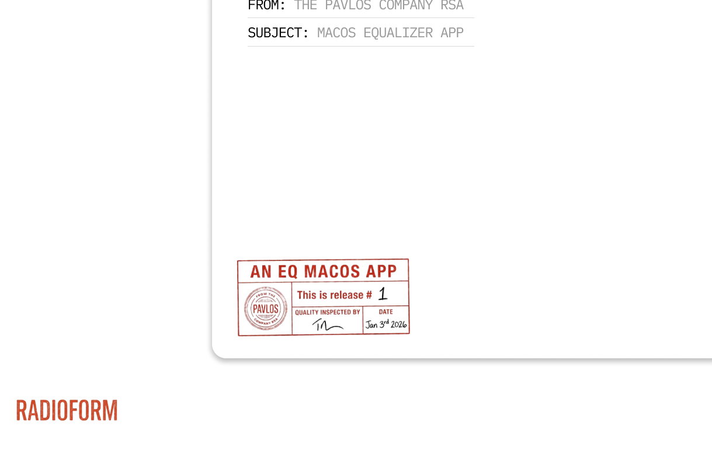

  <h1>Radioform</h1>
  
<em>A system equalizer for macOS.</em>

Radioform is a free, open-source system equalizer for macOS.  
It applies a clean, precise 10-band parametric EQ across everything you play.

## Design

Radioform is built as a small set of focused components, each doing one job well:

- **DSP Engine (C++)**  
  Real-time safe processing with a 10-band parametric EQ, preamp, and limiter.

- **Audio Driver (CoreAudio)**  
  A system output device that integrates directly with macOS.

- **Audio Host (Swift)**  
  Handles device management, shared-memory audio transfer, and DSP execution.

- **Menu Bar App (SwiftUI)**  
  A lightweight control surface that can quit and relaunch without interrupting sound.

## What You Can Do

- Apply system-wide EQ across all apps
- Shape sound with a 10-band parametric equalizer
- Keep levels safe with limiter and preamp guard rails
- Load bundled or custom presets (JSON), safely validated
- Switch devices without breaking your audio flow

## Performance

Radioform is designed to be invisible:

- Under 1% CPU usage on Apple Silicon
- Zero added latency in the signal path
- Clean, transparent audio with extremely low distortion

## Getting Started

- Download the latest release from the [Releases page](https://github.com/torteous44/radioform/releases)
- Select the **Radioform** output that matches your speakers or headphones
- Adjust, save, and forget about it

For development details, see [CONTRIBUTING.md](CONTRIBUTING.md).

## License

Radioform is released under the GNU General Public License v3.0.  
See `LICENSE` for details.
